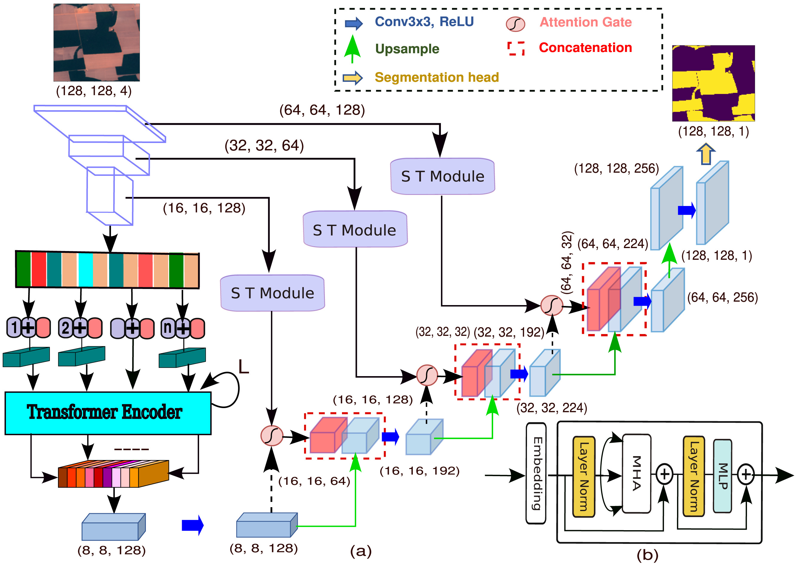

# e-TransUNet: TransUNet provides a strong spatial transformation for precise deforestation mapping

[Ali Jamali](https://www.researchgate.net/profile/Ali-Jamali), [Swalpa Kumar Roy](https://swalpa.github.io), and [Biswajeet Pradhan](https://profiles.uts.edu.au/Biswajeet.Pradhan)

___________

Citation
---------------------

**Please kindly cite the paper if this code is useful and helpful for your research.**

      @article{jamali2024transunet,
      title={e-TransUNet: TransUNet provides a strong spatial transformation for precise deforestation mapping},
      author={Jamali, Ali and Roy, Swalpa Kumar and Pradhan, Biswajeet},
      journal={Remote Sensing Applications: Society and Environment},
      pages={101221},
      year={2024},
      publisher={Elsevier}
      }

Acknowledgement
---------------------
Spatial Transformer Networks can be accessed from (https://arxiv.org/abs/1506.02025)

Weights
---------------------

## License

Copyright (c) 2024 Ali Jamali. Released under the MIT License. See [LICENSE](LICENSE) for details.
